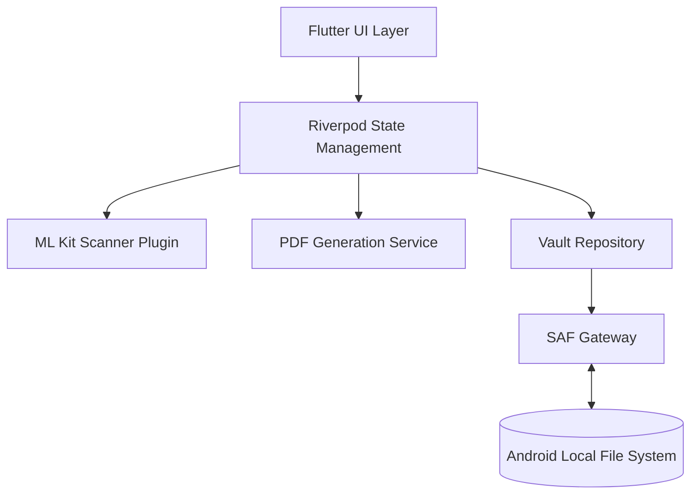

# ScanVault

**A fast, beautifully designed, fully-offline document scanner for Android.**

> No login. No cloud. No account. Your documents never leave your device.

ScanVault is a privacy-first document scanning application designed to give you absolute control over your data. It captures documents with your camera using advanced ML-based edge detection, securely manages your files with an in-app PIN protection, and persists everything directly to your local file system—all without making a single network call.

---

## 📑 Table of Contents
1. [Core Philosophy](#-core-philosophy)
2. [Key Features](#-key-features)
3. [Technical Architecture](#-technical-architecture)
4. [Data Storage & Vault System](#-data-storage--vault-system)
5. [Codebase Deep Dive](#-codebase-deep-dive)
6. [Feature Modules](#-feature-modules)
7. [Building & Running Locally](#-building--running-locally)
8. [License](#-license)

---

## 🛡️ Core Philosophy

ScanVault was built on three foundational principles:
1. **Absolute Privacy:** The app contains zero network requests, telemetry, or cloud syncing. What happens on your device stays on your device.
2. **Native Data Ownership:** Data is not hidden inside an opaque app sandbox. Through Android's Storage Access Framework (SAF), users pick an actual directory on their device (the "Vault") to store their documents.
3. **Resilience:** Because data is stored in the Vault folder, your documents survive app uninstalls. If you reinstall the app, you simply reconnect to your Vault folder and pick up exactly where you left off.

---

## 🌟 Key Features

* **ML Kit Powered Scanning:** Utilizes native ML Kit for buttery smooth, highly accurate document edge detection and perspective correction.
* **Batch Import & Gallery Support:** Scan multiple pages rapidly or import existing photos from your local gallery.
* **Vault Storage:** Direct read/write to a user-selected folder via Android SAF.
* **App PIN Lock:** Secure your app access with an encrypted 4-digit passcode lock built right into the authentication layer.
* **Stunning Minimalist Design:** Built with a handcrafted design system featuring glassmorphism overlays, dynamic glow effects, and first-class Dark/Light mode support.
* **Advanced Document Management:** Effortlessly merge multiple documents, reorder pages, and delete specific pages.
* **High-Quality Export:** Compile your scans into a PDF natively or share them directly as JPEGs via the Android share sheet.

---

## 🏗️ Technical Architecture

ScanVault is built for extreme performance using Flutter and Riverpod. 



### Tech Stack Highlights:
- **Framework:** Flutter / Dart
- **State Management:** `flutter_riverpod`
- **Scanning Engine:** `cunning_document_scanner` (ML Kit wrapper)
- **Local Storage/IO:** `saf_util` (Storage Access Framework wrapper)
- **Image Processing:** `image` & `image_cropper` (with future hooks for OpenCV `dartcv4`)
- **PDF Generation:** `pdf` & `printing`
- **Reordering:** `reorderable_grid_view`

---

## 🗄️ Data Storage & Vault System

The Vault system (`lib/src/data/vault/`) is the heart of the app's persistence layer. 

### Atomic Writes
Every database/file change uses a safe `temp → fsync → rename` strategy to prevent data corruption during unexpected crashes or power loss.

### Rebuildable Index Cache
To maintain immediate load times, ScanVault keeps an `index.json` at the root of the Vault. However, this is treated strictly as a cache. If the index is ever corrupted, deleted, or out of sync, the `VaultRepository` will automatically walk the file tree, read the individual `meta.json` files for each document, and seamlessly rebuild the index.

---

## 📂 Codebase Deep Dive

The project utilizes a clean feature-first architecture to separate concerns.

```text
lib/
├── src/
│   ├── app/            # App entry point, routing, and global themes
│   ├── core/           # Core utilities (failure handling, JSON parsers)
│   ├── data/           # Repositories, Vault subsystem, PDF export service
│   ├── domain/         # Immutable models (Document, DocPage, IndexEntry, VaultConfig)
│   ├── features/       # Feature-driven UI and specific providers
│   ├── utils/          # Standalone helpers (Document naming, UUID)
│   └── widgets/        # Reusable UI components (Buttons, Glass panes, Dialogs)
└── main.dart           # Main execution and Riverpod scope initialization
```

---

## 🧩 Feature Modules

The `lib/src/features/` directory is split into distinct domains:

- **`auth` (`pin_screen.dart`):** Handles the application-level PIN lock to restrict unauthorized access to the app.
- **`onboarding` (`splash_screen.dart`, `connect_screen.dart`):** Guides the user through granting directory permissions via SAF to establish the initial Vault.
- **`home` (`home_screen.dart`):** The central dashboard. Displays the document grid, handles multi-selection, and orchestrates merging and batch actions.
- **`document` (`document_detail_screen.dart`, `document_editor_screen.dart`, `page_viewer_screen.dart`):** The comprehensive document viewer and editor suite for viewing, cropping, and managing individual document pages.
- **`settings` (`settings_screen.dart`):** Manages user preferences, including PIN lock toggles and aesthetic settings.

---

## 📦 App Releases & Versioning

ScanVault is currently in active development (**v0.1.0+1**). The source code is hosted on [GitHub](https://github.com/AnandkumarMall/ScanVault).

* **Releases:** Compiled APKs and formal releases will be available in the [GitHub Releases tab](https://github.com/AnandkumarMall/ScanVault/releases).
* **Versioning:** Follows standard semantic versioning (`major.minor.patch`).

---

## 🕰️ Project Evolution & History

ScanVault has been methodically built in distinct phases to ensure stability and high performance:

* **Phase 1 (Foundation):** Core Flutter architecture, basic UI scaffolding, and on-device debug builds.
* **Phase 2 (Capture & Storage):** Introduced camera capture, local gallery import capabilities, and raw page saving to the SAF Vault. 
* **Phase 3 (Smart Processing):** Integrated OpenCV and ML Kit for automatic edge detection, perspective warping, and manual corner cropping.
* **Phase 4 (Refinement & Security):** Implemented the in-app PIN lock, comprehensive document merging, renaming logic, and massive performance optimizations. Added real-time image filters and post-save cropping (`image_cropper`).
* **Current State:** A robust, feature-rich offline document scanner featuring a custom, handcrafted calm design system and extensive batch management tools.

---

## 🚀 Building & Running Locally

### 1. Prerequisites
* **JDK 17** (Required by Flutter's Android toolchain).
* **Flutter SDK** (Version `3.38.0` or higher).
* **Android SDK** (Install `platform-tools`, `build-tools`, and relevant Android platforms).

### 2. Enable Native Assets
ScanVault relies on Dart hooks and native assets for local image processing libraries (`dartcv4`). You must enable this once per machine:
```bash
flutter config --enable-native-assets
```

### 3. Setup & Run
Clone the repository, fetch dependencies, and run on a connected Android device or emulator:
```bash
flutter pub get
flutter run
```

### 4. Build Optimized Release APK
To build a highly optimized, lightweight APK:
```bash
flutter build apk --release
```
Your compiled APK will be located in `build/app/outputs/flutter-apk/app-release.apk`.

---

## 📄 License

MIT License. Do whatever you want with it! Attribution is appreciated but not required.